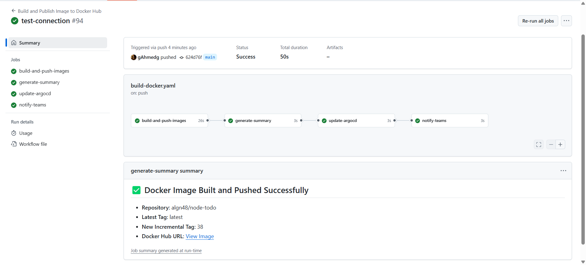
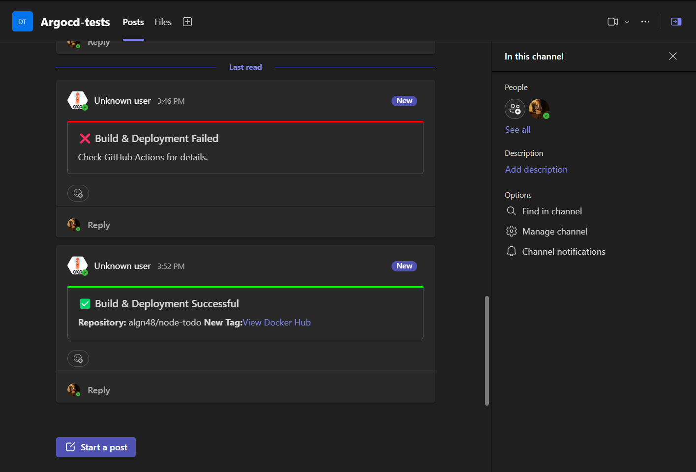

# 🚀 Node.js Todo App with CI/CD using GitHub Actions & ArgoCD

## 📌 Overview


This repository automates the **CI/CD pipeline** for the **Node.js Todo App** using **GitHub Actions, Docker, Kubernetes, ArgoCD, and Sealed Secrets**. The workflow builds and pushes the application Docker image to Docker Hub, encrypts sensitive data with the kubeseal CLI, updates the ArgoCD GitOps repo with the latest Deployment and SealedSecret manifests, triggers a deployment, and sends success or failure alerts to **Microsoft Teams** via an incoming webhook.


## 🔧 Technologies Used
- **✅ GitHub Actions** – Automates build and deployment.
- **🐳 DockerDocker** – Containerizes the application.
- **☸️ Kubernetes** – Manages deployments and scaling.
- **🎯 ArgoCD (GitOps)** – Implements GitOps for continuous deployment.
- **🗄️MySQL** – Stores application data.
- **📬 Microsoft Teams** – Sends deployment notifications.
- **🔐 Bitnami Sealed Secrets** for secure secret management
- **🛡️Sealed secret encryption using `kubeseal` CLI**


## 🔐 Secure Secret Management

To ensure Kubernetes secrets are not exposed in the Git repository, this project uses:

- **Sealed Secrets Controller** (installed in the Kubernetes cluster)
- `kubeseal` CLI to encrypt secrets
- Encrypted `SealedSecret` files committed to the GitOps repo
- ArgoCD automatically decrypts secrets during deployment

## 🏗️ CI/CD Workflow
The GitHub Actions workflow consists of four jobs:

### 1️⃣ **Build & Push Docker Image**
- **Triggers** on `push` to the `main` branch.
- Builds a Docker image and tags it as `latest`.
- Retrieves the latest image tag from Docker Hub and increments it.
- Pushes the new image to Docker Hub.

### 2️⃣ **Generate Summary**
- Retrieves the newly created image tag.
- Generates a summary of the build process for GitHub Actions.

### 3️⃣ **Update ArgoCD Repository**
- Clones the `argocd-example-apps` repository.
- Updates the Kubernetes deployment manifest with the new image tag.
- Commits and pushes the changes.

### 4️⃣ **Notify Microsoft Teams**
- Sends a notification on **success** or **failure** of the workflow.

## 📜 Setup & Usage
### 1️⃣ **Pre-requisites**
Ensure you have the following configured:
- Docker Hub account with repository access.
- Kubernetes cluster managed by ArgoCD.
- A `k8s/deployment.yaml` file in the ArgoCD repository.
- A Microsoft Teams webhook URL for notifications.

### 2️⃣ **Secrets Configuration**
In your GitHub repository settings, add the following **secrets**:
| Secret Name          | Description |
|----------------------|-------------|
| `DOCKERHUB_TOKEN`   | Docker Hub access token |
| `GH_PAT`            | GitHub Personal Access Token (for pushing updates to ArgoCD repo) |
| `TEAMS_WEBHOOK_URL` | Microsoft Teams webhook URL |

### 3️⃣ **Deployment Steps**
1. **Push changes to `main` branch**
2. **GitHub Actions runs automatically**
3. **ArgoCD detects the new image tag and deploys it**
4. **Microsoft Teams receives a notification**

## 📂 Folder Structure
```
CD-REPO
📦 argocd
├── 📂 k8s-sealedsecret         # Kubernetes manifests
│   ├── deployment.yaml                 # Kubernetes deployment definition
│   ├── my-sealed-secret-app.yaml       # Encrypted secret for the application
│   ├── my-sealed-secret-db.yaml        # Encrypted secret for the database
│   ├── mysql.yaml                      # MySQL Deployment and Service


```
```
CI-REPO
📦 node-todo
├── 📂 .github
│ ├── 📂 workflows
│ │ ├── ci-cd.yml # GitHub Actions workflow for CI/CD
├── 📄 Dockerfile # Docker build file
├── 📄 README.md # Documentation
├── 📂 node_modules # Project dependencies
├── 📄 package.json # Project metadata and dependencies
├── 📂 repo # Repository-related files
├── 📂 spec # Test specifications
├── 📂 src # Source code
├── 📄 yarn.lock # Dependency lock file
```
## 🎯 ArgoCD Deployment File Example (`argocd-example-apps/k8s-sealedsecret`)

```yaml
apiVersion: apps/v1
kind: Deployment
metadata:
  name: node-todo
spec:
  replicas: 2
  selector:
    matchLabels:
      app: node-todo
  template:
    metadata:
      labels:
        app: node-todo
    spec:
      containers:
        - name: node-todo
          image: algn48/node-todo:latest
          ports:
            - containerPort: 3000
```

## 📌 Monitoring & Troubleshooting
- **Check Workflow Runs:** GitHub Actions ➝ `Actions` Tab
- **Verify Image in Docker Hub:** [Docker Hub Repository](https://hub.docker.com/r/algn48/node-todo)
- **Monitor ArgoCD Deployment:** Run `kubectl get pods -n <namespace>`
- **Check Logs:** `kubectl logs -f <pod-name>`
- **Teams Notification:** Alerts for success/failure

### 📷 CI/CD Pipeline Screenshot



---

### 📢 Microsoft Teams Notifications

This project integrates **Microsoft Teams** notifications to report the status of CI/CD pipelines.

- ✅ **Success Alerts**: Sent when a pipeline or deployment completes successfully.
- ❌ **Failure Alerts**: Sent when a job or step fails.
- 🔄 Triggered from GitHub Actions via an **Incoming Webhook URL** configured in the Teams channel.



### 🔗 References
- [GitHub Actions Documentation](https://docs.github.com/en/actions)
- [Docker Hub](https://hub.docker.com)
- [ArgoCD Documentation](https://argo-cd.readthedocs.io/)

